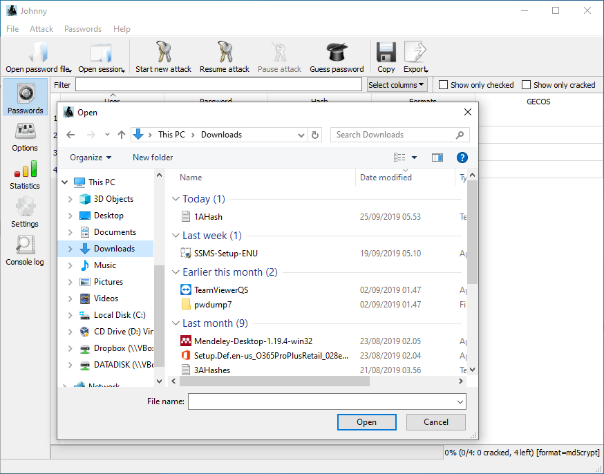

# John The Ripper

John the ripper is often used to crack user passwords. 

Today we will use John the ripper to learn about key length and complexity and time requirements.

## Install

The guide is for Windows users. If you use Linux, you can just install it from repositories.

We need two pieces of software for this activity:

1. John the Ripper: This is what does the actual cracking.
2. Johnny: The graphical user interface to make it easier.

### John the Ripper

Download John the Ripper Windows Binaries from [here.](https://www.openwall.com/john/k/john-1.9.0-jumbo-1-win64.zip)

Right click the downloaded file and choose extract all.

Windows will prompt you for a location. Extract the contents of the zip file somewhere easy to remember. Perhaps into your documents directory.

If you won't use the GUI this is all you need. Else proceed to installing Johnny.

### Johnny

Download Johnny from [here.](https://openwall.info/wiki/_media/john/johnny/johnny_2.2_win.zip)

There is an executable file in the downloaded zip file. Run it and install Johnny. 

You need to configure Johnny to use John the ripper binaries (executable files). Open the settings and point Johnny to john.exe. If you extracted John the ripper to your Documents folder the file should be in there.

## Broad Idea

In the course, you have learned about encryption, hashing, and authentication. This exercise is designed to reinforce some of these ideas while having the students give some thought to encryption key complexity.

The files we will crack in this exercise are not actual encryption keys, but the principle of brute forcing remains the same.

### Some Background on Storing Passwords

Passwords are the standard method of authentication. You enter the passsword, system makes sure it is correct, and then you are assumed to be who you say you are.

The default way of storing passwords is to store them as hashes. This way if the adversary gains access to the system, they won't immediately have access to the passwords.

Remember the hash function, it takes an input and creates a summary of it. Hashing is not reversible. So you can not reproduce the original password from the hash. When you enter your password, the system generates a hash of your input, and compares the hash generated to the hash that is stored.

There are various ways to crack these hashed password files. For example, comparing against a table of pre-calculated hashes (rainbow tables) or trying all words in a list (dictionary attack). There are also some common precautions such as adding known series of letters and numbers (salting) to the passwords before hashing them.

Today we will focus on Brute Force attacks. Brute forcing is trying all possible combinations for passwords to see if any work. On a live system, the system often disables the user account after a certain number of tries (or forces a cooldown timer) to prevent these kinds of attacks. That is why hackers often extract the password hashes and work on the hashes file separately to see if they can gain some user credentials.

I will provide you with a series of hashes of increasing complexity and I want you to observe how password complexity can increase the time to crack a password.

## Using Johnny

John the Ripper is a very flexible tool that can carry out a broad range of password cracking techniques. For this exercise we will restrict it to incremental (brute force) mode. Brute force in its essence is searching the space of all valid passwords for the correct password, by testing each one in turn.

If we knew the password was 3 letters long and was only composed of the lower case letters a to z, there would be 26^3 = 17576  possible combinations that would make a valid password. 

Let us see how long it takes on your computer (faster computers can try more passwords in a given time) to crack such a password. [Here is a file with hashes of 4 passwords of 3 lower case letters .](3AHashes.txt)

Download the file and open it with Johnny.

This is what you should be seeing now.

First configure Johnny to not take any shortcuts, and use pure brute forcing attack. Click options, and select "Incremental" from the tabs. We want to specify "Lower" as the charset. We know the password is only made of lower case letters. Restricting the charset is important as otherwise cracking may take too long (John the ripper will default to ASCII search).

Once ready select "Start New Attack" from top bar. You can then go to statistics and collect work time statistics. 

If you click back to passwords, you will eventually see them getting cracked one by one.

Make note of how long it takes to crack four passwords. On my beefy system this takes about 8 minutes.

Now there is two obvious ways to expand the space of possible valid passwords. You can either add more symbols (6 digit, 10 digit, 13 digit), or more kinds of symbols (numbers, upper case letters, punctuation marks...).

[Here is a file for 4 passwords and 3 upper, lower case letters, and numbers.](3ANHash.txt) You will need to replace "Lower" with "Alnum" from charset to force all 62 alphanumeric characters. The possible solution space is 62^3 = 238328. This may take twice as long as the first file.

[Now here is another file with hashes for 4 passwords, this time made out of 5 lower case letters.](5AHashes.txt) Configure it as it was for the first trial. Just run it and see the difference in how long it takes. The possible solution space is 26^5 = 11881376 As you can see, this will take some time to crack, you may need to continue at home.

## Take Aways

I hope this exercise has reinforced a few points made in the lecture. The strength of the key (password) determines the difficulty of breaking encryption. I hope you have also remembered how hash functions work and how they can be used in storing information in a safe way. 

I am hoping the discussion on password length and characterset is going to allow you to better appreciate the role of a strong password policy in an organization. 

As you have seen cracking passwords can be time intensive, though with enough computing power it is not impossible. Which is why serious organizations force password changes from time to time. You want the information hackers may have obtained to be irrelevant by the time they manage to crack it.

Beyond the relevance to lecture content, I hope you will also derive some practical benefit from this exercise. John the ripper is a useful tool not just for hackers. Today we seriously crippled its ability by forcing brute force attacks but it is generally very fast in getting at common passwords. As a system admin, you may want to make sure your users have chosen passwords that are hard to guess. It may even be helpful to recover the password for a friend some day. 

If you want try your hand with [this file](SimpleHashes.txt) and run with default configuration. You will note John can crack these 6 character passwords in no time.

