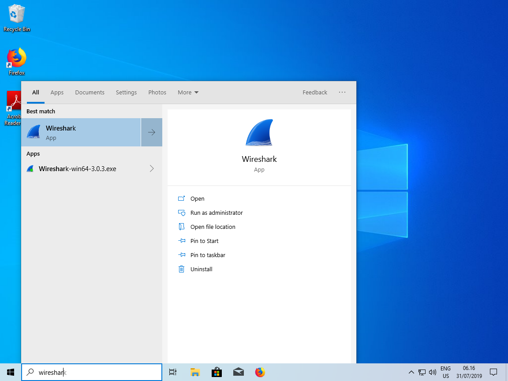
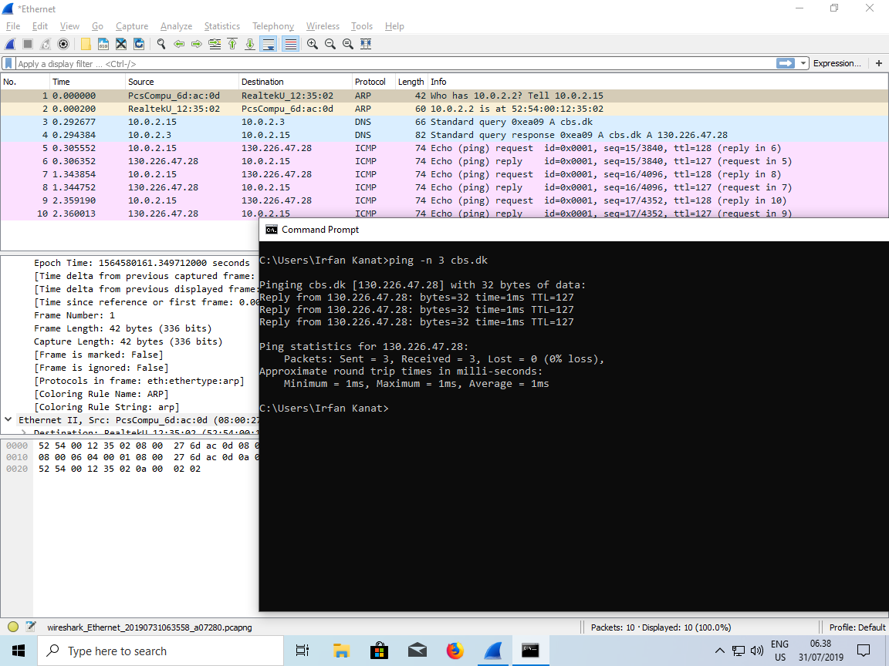

# Ping Capture Procedure

This is the procedure I used to capture the ping data used in wireshark exercise.

Launch the windows command prompt. (You can do this by typing cmd in the windows start menu). We will use the command prompt to generate short bursts of traffic which we will analyze.

Launch wireshark. You can find it in the Start Menu.

After wireshark initializes you can see a list of network interfaces.

Depending on your hardware, there will probably be a wired ethernet and a wireless ethernet adapter (and may be a few other odds and ends).

Select the interface you want to use. Correct interface depends on how you connect to the network. I will be using wired ethernet (as my workstation does not have a wireless interface).

Once you select the interface the capture icon on the top left will become clickable. The capture icon looks like a shark fin. 

After you click the capture button, switch to the command prompt and ping cbs.dk. Use the command below to stop capture after 3 ICMP packages.

    ping -n 3 cbs.dk

As soon as the ping is over, click the red square on the top right corner to stop capture. We don't want to capture any other traffic (It can get confusing otherwise).

This is how it should look like during the capture:

