# Wireshark

Today's exercise is to solidify the concepts learned in the classroom. We will specifically focus on the TCP/IP 5 Layer Stack and how it looks in action.

For this purpose we will use a tool called wireshark. Wireshark is a packet sniffer. It can be used to record and inspect traffic going through your network interfaces (wireless, ethernet...).

You should be careful when using this tool in organizational networks. Since there is the possibility of intercepting traffic not meant for you, you may violate law or the policy. This is why I recommend not using wireshark outside of your home network.

## Installation

Wireshark is an open source tool and can be freely obtained from [https://www.wireshark.org/](https://www.wireshark.org/).

Download the appropriate version for your computer and run the downloaded file.

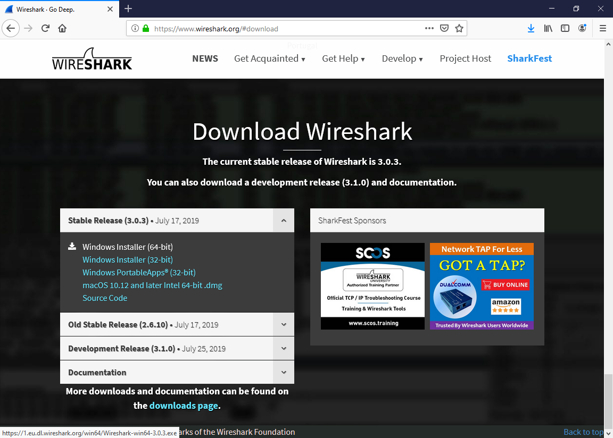

Installation is straighforward. Default settings are sane and you don't need to change anything. Just proceed as advised.

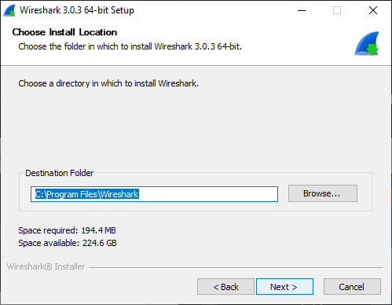

At the end of the installation you will need to restart your computer.

## Wireshark Capture

It is important to keep your network activity very limited during this exercise. Your computer generates quite a few packages by itself. You browsing the net during capture may produce an overwhelming number of packages. If you have services that use network data (dropbox, spotify, etc.), it may be a good idea to turn them off.

Launch the windows command prompt. (You can do this by typing cmd in the windows start menu). We will use the command prompt to generate short bursts of traffic which we will analyze.

Launch wireshark. You can find it in the Start Menu.

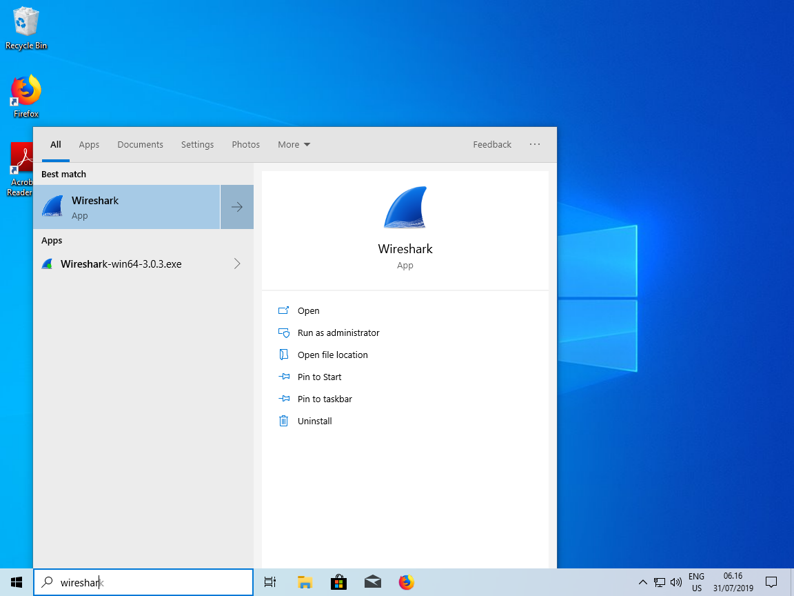

After wireshark initializes you can see a list of network interfaces.

Depending on your hardware, there will probably be a wired ethernet and a wireless ethernet adapter (and may be a few other odds and ends).

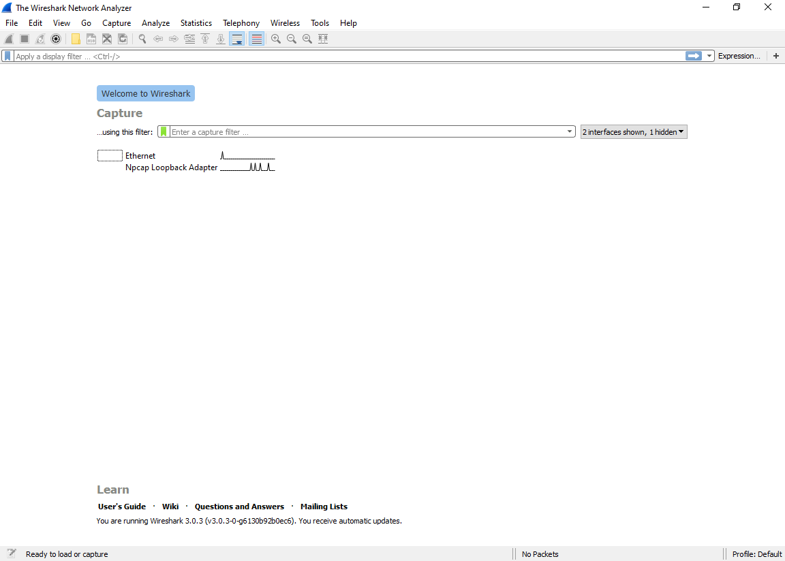

Select the interface you want to use. Correct interface depends on how you connect to the network. I will be using wired ethernet (as my workstation does not have a wireless interface).

Once you select the interface the capture icon on the top left will become clickable. The capture icon looks like a shark fin. 

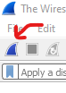

After you click the capture button, switch to the command prompt and ping cbs.dk. Use the command below to stop capture after 3 ICMP packages.

    ping -n 3 cbs.dk

As soon as the ping is over, click the red square on the top right corner to stop capture. We don't want to capture any other traffic (It can get confusing otherwise).

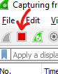

This is how it should look like during the capture:

There is a lot that can go differently and your results may be different. I am attaching the results of my capture here. You can use my results to more easily follow along.

[ping capture](pingCapture.pcapng)

## Wireshark Analysis

This is what it should look like:

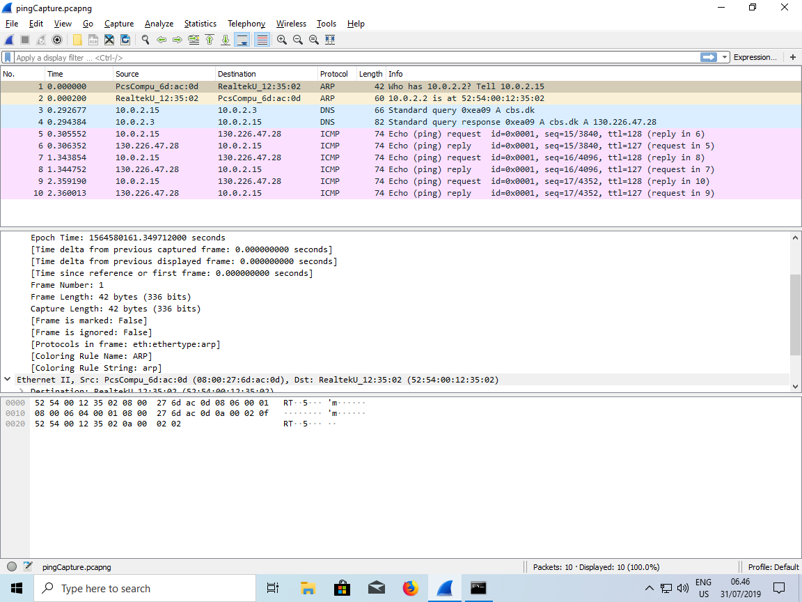

You can see we intercepted 10 packages in about 2 seconds.

Since my computer did not know how to get to cbs.dk, some address resolution was necessary. Now I want you to look at the protocol column. Some of these protocols should be similar from in class demoland activities.

ARP protocol to resolve IP addresses to MAC addresses (Layer 2).

DNS protocol to resolve URL (cbs.dk) to IP addresses.

Finally ICMP packages our ping command generated.

If you look at the source and destination addresses you will see that each packet we generated on our end (My IP address was 10.02.15) was answered by a response.

### DNS Packet

Let us take a look at the first DNS packet. Click the first DNS packet.

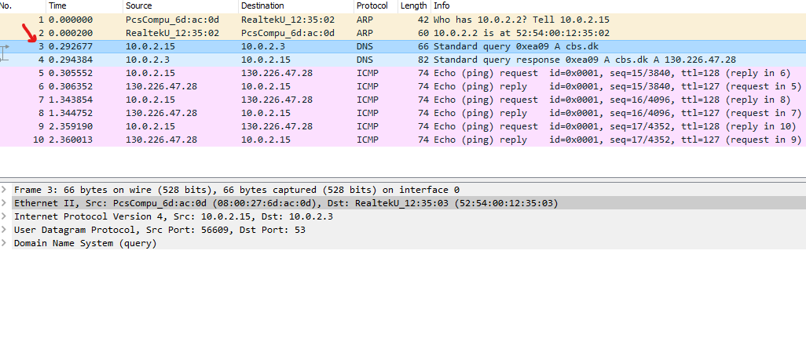

Now the middle part of the screen shows the information the packet contains.

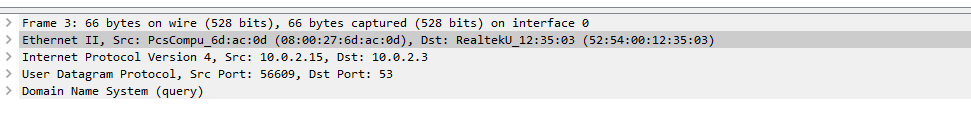

From top to bottom, these correspond to the five layers of the TCP/IP protocol stack.

You can see the source and destination MAC addresses in layer 2 (Link).

Source and destination IP addresses in layer 3 (Network).

The transport protocol used (UDP) in layer 4 (Transport).

And finally the application protocol in layer 5 (DNS).

Let us investigate layer 5. We know that our computer asks the DNS server about cbs.dk. Click "Domain Name System (query)" to see the information contained in that layer.

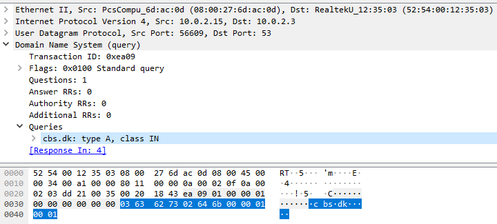

You can see the interpretation of the protocol in human readable format in the middle pane. The bottom pane displays the hexadecimal representation of the data.

To finish up, let us inspect the response from the DNS server. Click on the next DNS packet. 

You can see in the response the addresses of the destination and source are switched. So this message is from the DNS server (10.0.2.3) to my computer (10.0.2.15).

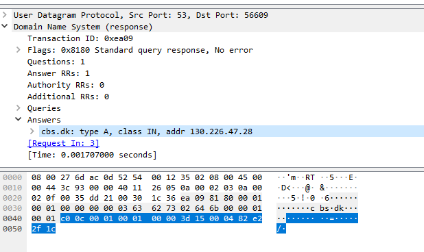

The answer indicates cbs.dk can be reached at 130.226.47.28.

### ICMP Ping

ICMP is a protocol used by network devices to communicate with each other. It is used to send error messages, and operational information. As such it is not used to exchange data. We used ICMP protocol to verify that cbs.dk was up.

Since ICMP is a layer 3 protocol (remember routers operate at layer 3) you will see that the transport layer headers are missing.

What I want you to note here is the time differences between requests and responses. You might be familiar with ping as a measure of latency in online games. Essentially it is measuring how long it takes to get information from the server.

